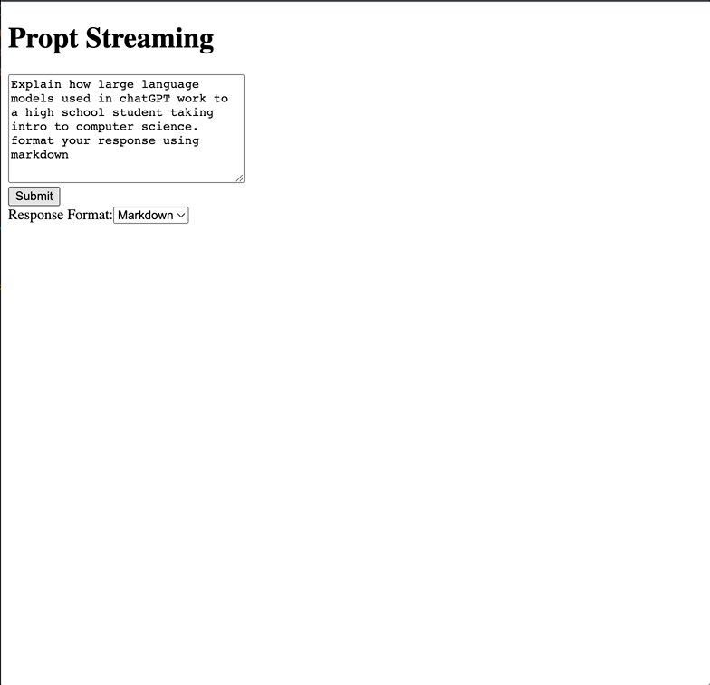

# OpenAI Streaming Demo App

This repo demonstrates the use of OpenAI's streaming API with Next.js 13 and edge functions. The app directly fetches requests from OpenAI with streaming enabled, using the `gpt-3.5-turbo` chat completion model.

## Features

- Built with Next.js 13
- Utilizes Vercel Edge functions for efficient API call processing
- Direct `fetch` requests to OpenAI with streaming enabled
    - No overhead of the full openapi client package and its depedancies
- Chat completion using `gpt-3.5-turbo` for good, fast and cheap replies.
- Formats the responses using [react-markdown](https://www.npmjs.com/package/react-markdown)



## Benefits

Edge functions only charge for processing time, while standard serverless functions charge for the total execution time. GPT API calls can take several seconds to complete the response, and in some cases exceed the free tier of Vercel. This project aims to reduce those costs.

## Inspiration

The core edge function code is based on [Building a GPT-3 app with Next.js and Vercel Edge Functions](https://vercel.com/blog/gpt-3-app-next-js-vercel-edge-functions), but it's been updated to use chat completion API, and `gpt-3.5-turbo`.


## Prerequisites

You will need to add a local `.env` file with the following keys:

```
OPENAI_API_KEY="..."
```

This example if deployed to vercel for testing would let anyone make requests with your API key so be careful.


This is a [Next.js](https://nextjs.org/) project bootstrapped with [`create-next-app`](https://github.com/vercel/next.js/tree/canary/packages/create-next-app).

## Getting Started

First, run the development server:

```bash
npm install
npm run dev
```

Open [http://localhost:3000/playground](http://localhost:3000/playground) with your browser to see the result.